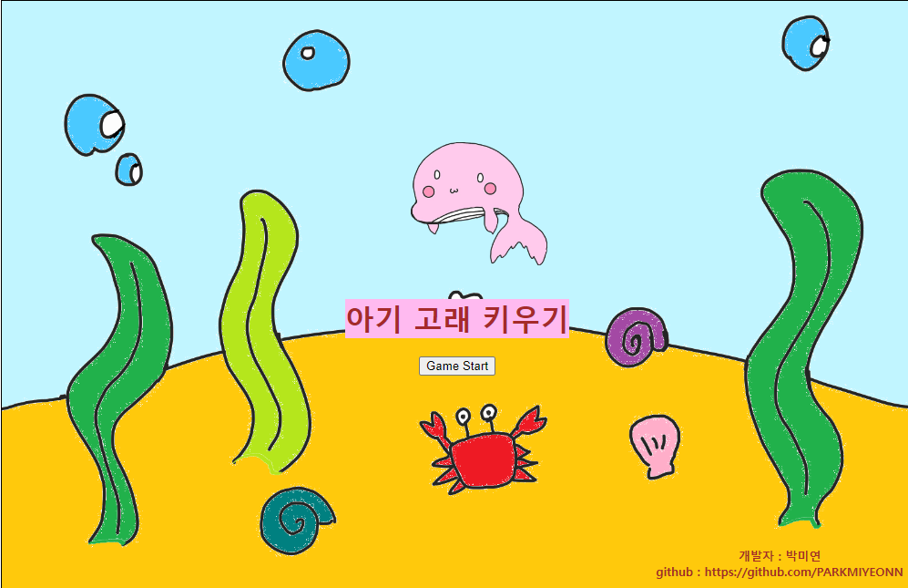
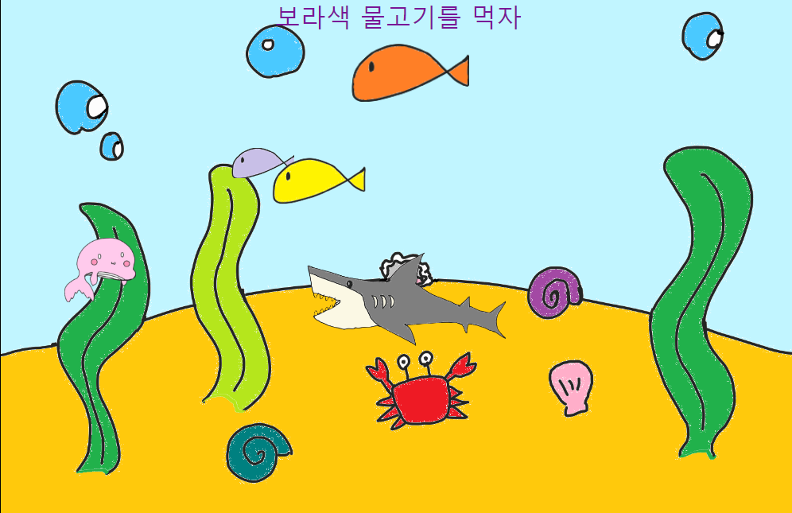
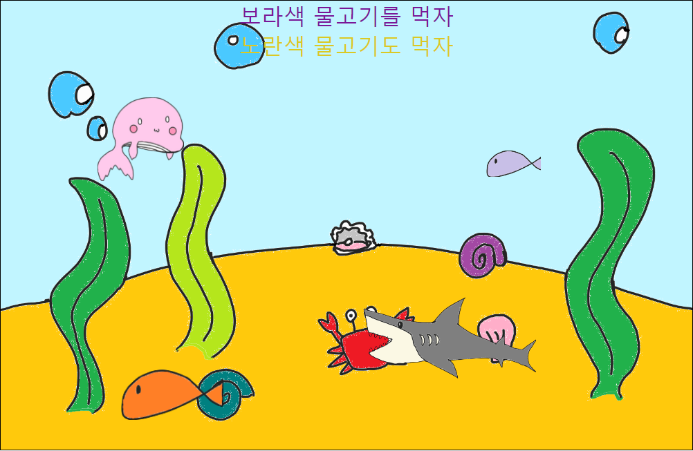
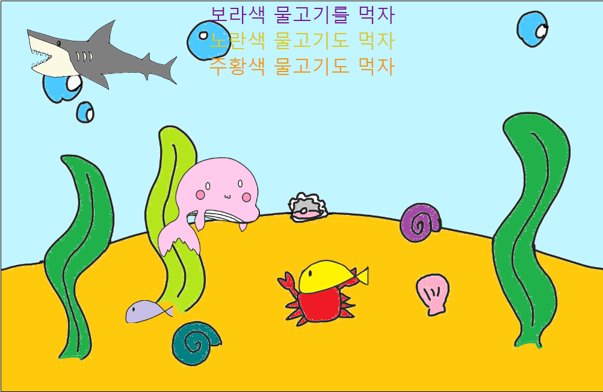
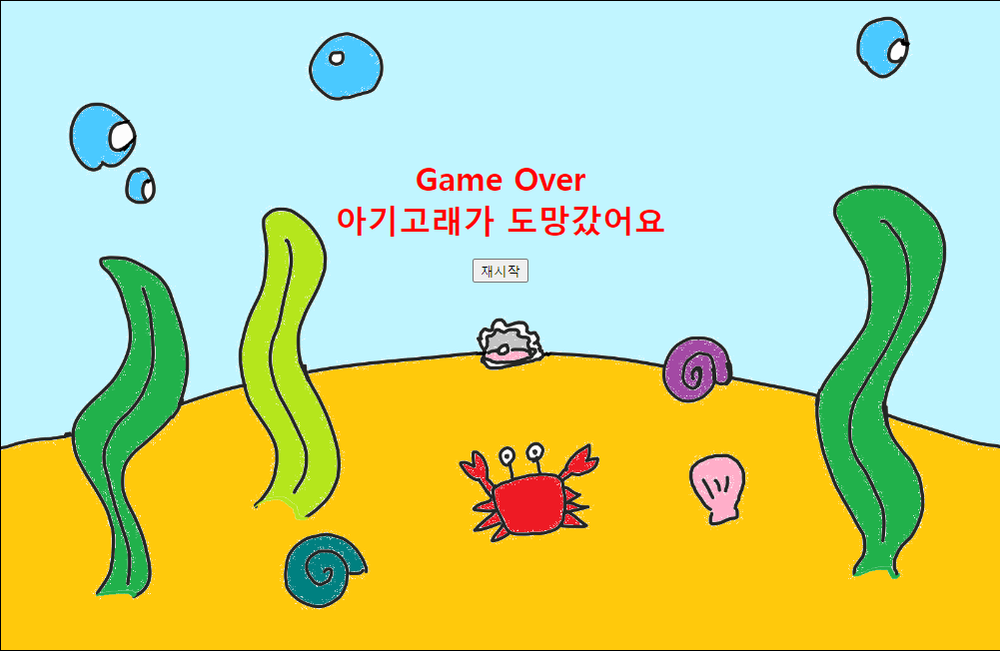
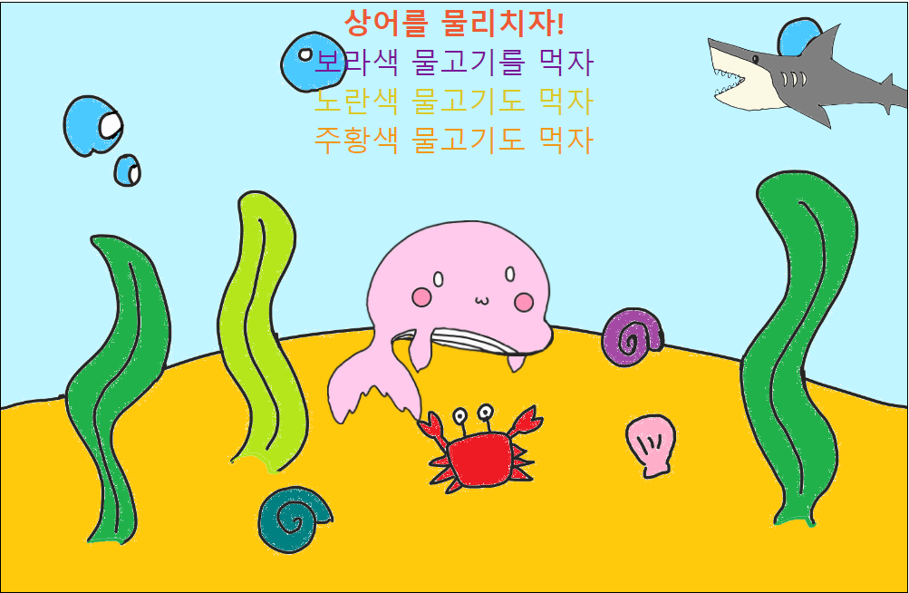
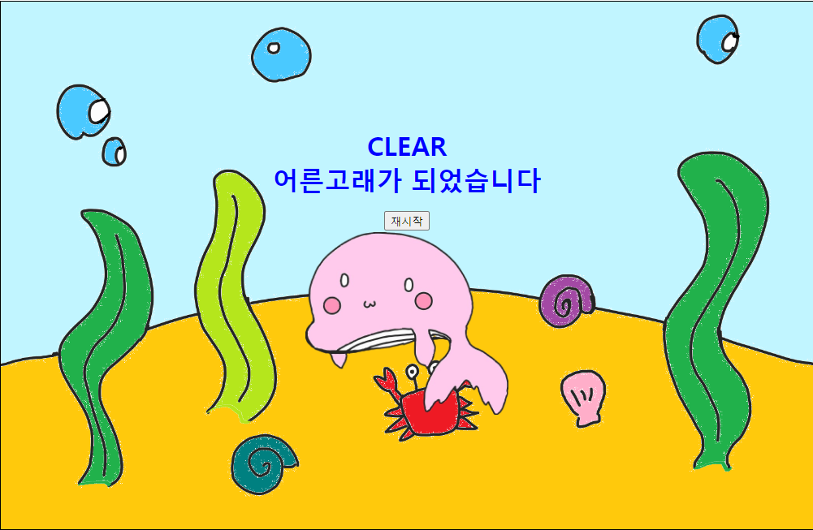

# web-basic
# 아기 고래 키우기 
https://parkmiyeonn.github.io/web-basic/gameMY/exam01.html  

## 물고기 먹기
- 자신의 크기보다 작은 물고기를 먹어 조금씩 성장!!
- 성장 정도에 따라 보라색, 노란색, 주황색 물고기를 먹을 수 있음

## 게임 오버
- 자신보다 큰 물고기와 닿으면 게임 오버. 돌고래가 도망친다
- 

## 상어를 물리치자
- 계속해서 성장하여 상어보다 크기가 커지면 상어를 물리칠 수 있다!
- 
- 상어를 물리치면 게임 클리어! 어른 고래가 되어 떠난다
- 

